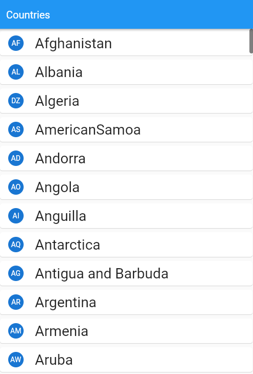

# read_json_data

This is an example of how to read data from a .json file. Retrieved data listed by using FutureBuilder class.
 ## App Review

## References
[JSON and Serialization](https://docs.flutter.dev/development/data-and-backend/json)
[FutureBuilder](https://api.flutter.dev/flutter/widgets/FutureBuilder-class.html)
[AssetBundle](https://api.flutter.dev/flutter/services/AssetBundle-class.html)
